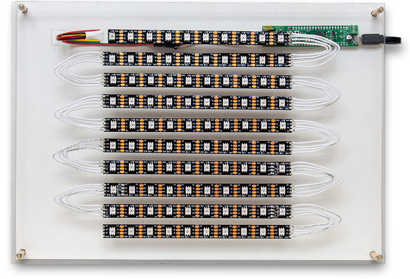

# PixelWall
> An IoT interactive pixel wall implementation

This project is an implementation of an LED wall controlled through the internet via the REST API. This repository holds the code required for setting up the physical microcontroller and LED strip in order to properly receive and display images from the server. For the code that handles connecting the LED to and the users, please go [here](https://github.com/RutgersUniversityVirtualWorlds/pixelserver).

## Installing / Getting started



To build your own pixelwall, you'll need a strip of APA102C LEDs, a microcontroller(such as the Arduino Uno or our fubarinoMini), and a raspberry PI (in order to connect it to the web).

The LEDs will connect to the microcontroller and the microcontroller to the Raspberry PI (or your own computer). The LED strip is broken into smaller strips and those strips should be arranged in a back and forth pattern, with the leading LED having the necessary wires that need to be connected to the microcontroller. Please refer to the image above.

Next, you'll need to set up the microcontroller. To do so, you must compile the StandardFirmataChipKITLEDStrip.ino file, found in the arduino folder, using the Arduino IDE in order to create the protocol for communicating with the microcontroller using your computer(raspberry PI). This only needs to be done once for setting up the microcontroller. In order to do this: 

- If your board is already installed in the Arduino IDE, then you only need to install the Adafruit Dotstar LED Library from Sketch->Include Library->Manage Libraries... and then you can compile the StandardFirmataChipKITLEDStrip.ino file onto the microcontroller.

- If you are using the fubarinoMini, you must first [add the board manager for fubarinoMini via URL from within the Arduino IDE](http://chipkit.net/wiki/index.php?title=ChipKIT_core) and then install the chipKIT board manager. Then you must install the Adafruit Dotstar LED Library from Sketch->Include Library->Manage Libraries... Finally select your microcontroller from Tools->Board(ChipKIT), set the serial port it is connected to, and compile the StandardFirmataChipKITLEDStrip.ino file on the fubarinoSD.

Note: you may want to configure the NUMPIXELS variable on StandardFirmataChipKITLEDStrip.ino to the number of LEDs in your LED strip before compiling. We are planning to modify this so it can be done outside of having to compile the microcontroller.

Once the microcontroller is set up for communication, we need to set up the raspberry pi. To do so, run the following at the root of this repository loaded onto the PI:

```shell
npm install 
```

This should install all the dependencies required for the project to run.
Now connect the microcontroller to your computer and run the setup.js file.

```shell
node ./setup.js
```

This will tell node what port the microcontroller is connected to in order to send our commands and will also prompt the user for the dimmensions of the LED wall.

The pixelwall should now be set up, and to have it running simply type:

```shell
node ./index.js
```

This will get the pixelwall running, and expose a REST API to communicate with the wall starting at /things/pixelwall

## Configuration

Configuration is managed by setup.js but manual configuration can be done at ./config/default.json.
In order for the LED to work, we need to indicate the port number it is connected to and the dimmensions of the wall in order to allow the proper display of images on the wall.

## Tests

To run the tests simply type the following:

```
npm test
```
Tests can be found in ./tests/ and are built on mocha and chai.

## Licensing

This project is licensed under the Apache License 2.0.
For a copy of this license please go [here](https://www.apache.org/licenses/LICENSE-2.0.html).
