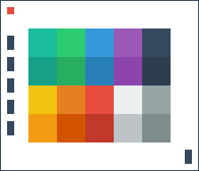

# PixelWall
> An IoT interactive pixel wall implementation

This project is an implementation of an LED wall controlled through the internet with the use of node, vue.js, johnny-five.js, and a microcontroller.

## Installing / Getting started

In order to complete setup for the fubarinoSD microcontroller, you must compile the StandardFirmataChipKITLEDStrip.ino file using the Arduino IDE in order to create the protocol for communicating with the microcontroller using your computer. This only needs to be done once for setting up the microcontroller.

To do this, you must first [add the board manager for fubarinoSD via URL from within the Arduino IDE](http://chipkit.net/wiki/index.php?title=ChipKIT_core) and then install the chipKIT board manager. Then you must install the Adafruit Dotstar LED Library from Sketch->Include Library->Manage Libraries... Finally select your microcontroller from Tools->Board(ChipKIT), set the serial port it is connected to, and compile the StandardFirmataChipKITLEDStrip.ino file on the fubarinoSD.

Note: you may want to configure the NUMPIXELS variable on StandardFirmataChipKITLEDStrip.ino to the number of LEDs in your LED strip before compiling.

Once the microcontroller is set up for communication, run the following at the root of the repository:

```shell
npm init
```

This should install all the dependencies required for the project to run.
Now connect the fubarinoSD to your computer and run the listSerialPort.js file.

```shell
node listSerialPort.js
```

This tells node what port the microcontroller is connected to in order to send our commands.

The microcontroller should now be setup to receive commands directly from node.

## Developing

### TO DO
### Built With
List main libraries, frameworks used including versions (React, Angular etc...)


### Prerequisites

What is needed to set up the dev environment. For instance, global dependencies or any other tools. include download links.


### Setting up Dev

Here's a brief intro about what a developer must do in order to start developing
the project further:

```shell
git clone https://github.com/your/your-project.git
cd your-project/
packagemanager install
```

And state what happens step-by-step. If there is any virtual environment, local server or database feeder needed, explain here.

### Building

If your project needs some additional steps for the developer to build the
project after some code changes, state them here. for example:

```shell
./configure
make
make install
```

Here again you should state what actually happens when the code above gets
executed.

## Versioning

We use [SemVer](http://semver.org/) for versioning.
Roughly, the version number represents MAJOR.MINOR.PATCH where an increment is
    MAJOR version when you make incompatible API changes,
    MINOR version when you add functionality in a backwards-compatible manner, and
    PATCH version when you make backwards-compatible bug fixes.

## Configuration

### TO DO
Here you should write what are all of the configurations a user can enter when
using the project.

## Tests

### TO DO
Describe and show how to run the tests with code examples.
Explain what these tests test and why.

```shell
Give an example
```

## Style guide

### TO DO
Explain your code style and show how to check it.

## Licensing

This project is licensed under the Apache License 2.0.
For a copy of this license please go [here](https://www.apache.org/licenses/LICENSE-2.0.html).
